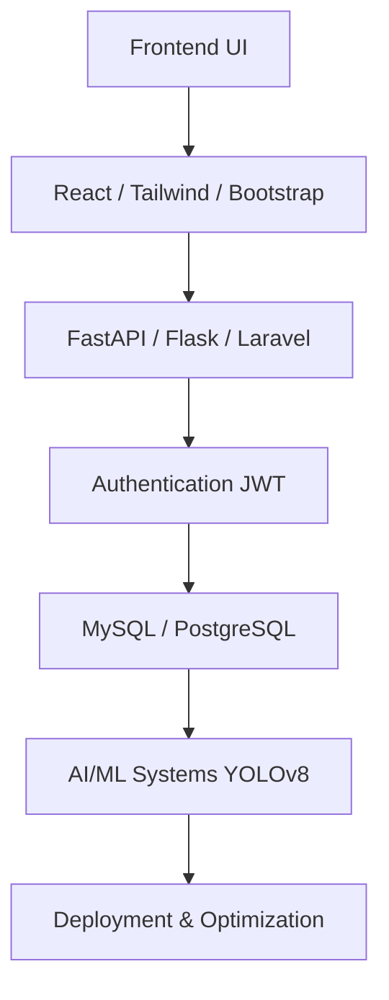

# <div align="center">🚀 ALL FEATURED PROJECTS 🚀</div>

---

<table>
<tr>
<td width="50%">

# 🛰️ SATELLITE IMAGE DETECTION SYSTEM

```diff
+ AI Powered Detection Platform
+ YOLOv8 Real-time Detection
+ GIS Visualization System
+ JWT Authentication
+ FastAPI + Flask Backend
+ PostgreSQL Database
```

### ⚡ TECHNOLOGIES

- Python
- React 18
- FastAPI
- Flask
- YOLOv8
- OpenCV
- PostgreSQL
- JWT
- Leaflet.js

</td>

<td width="50%">


</td>
</tr>
</table>

---

<table>
<tr>
<td width="50%">


</td>

<td width="50%">

# 🛒 GROCERY STORE MANAGEMENT SYSTEM

```yaml
Features:
  - Inventory Management
  - Billing System
  - Product Management
  - User Roles
  - Analytics Dashboard
  - Responsive UI
```

### ⚡ TECHNOLOGIES

- PHP
- SQL
- JavaScript
- Bootstrap

</td>
</tr>
</table>

---

<table>
<tr>
<td width="50%">

# 👨‍💼 EMPLOYEE MANAGEMENT SYSTEM

```yaml
Features:
  - Employee Records
  - Admin Dashboard
  - Search & Filter
  - Responsive Design
  - Dynamic UI
```

### ⚡ TECHNOLOGIES

- PHP
- MySQL
- JavaScript
- Tailwind CSS

</td>

<td width="50%">


</td>
</tr>
</table>

---

<table>
<tr>
<td width="50%">


</td>

<td width="50%">

# 🏫 CLASSROOM MANAGEMENT SYSTEM

```yaml
Features:
  - Attendance Management
  - Student Records
  - Assignment Tracking
  - Role Based Access
  - Dashboard UI
```

### ⚡ TECHNOLOGIES

- PHP
- MySQL
- JavaScript
- Tailwind CSS

</td>
</tr>
</table>

---

<table>
<tr>
<td width="50%">

# 🏢 SOCIETY MANAGEMENT SYSTEM

```yaml
Features:
  - Resident Management
  - Maintenance Tracking
  - Admin Panel
  - Payment Management
  - Responsive Dashboard
```

### ⚡ TECHNOLOGIES

- PHP
- MySQL
- JavaScript
- Bootstrap

</td>

<td width="50%">


</td>
</tr>
</table>

---

# <div align="center">⚡ PROJECT POWER LEVEL ⚡</div>

<div align="center">

| Project | UI/UX | Backend | Database | Performance |
|---|---|---|---|---|
| Satellite Detection System | ██████████ | ██████████ | ██████████ | ██████████ |
| Grocery Store System | █████████ | █████████ | ████████ | █████████ |
| Employee Management | █████████ | ████████ | ████████ | ████████ |
| Classroom Management | ████████ | ████████ | ███████ | ████████ |
| Society Management | ████████ | ████████ | ███████ | ████████ |

</div>

---

# <div align="center">⚔️ PROJECT ARCHITECTURE ⚔️</div>



---

<div align="center">

# 🚀 BUILDING REAL WORLD SOFTWARE SYSTEMS 🚀

</div>
